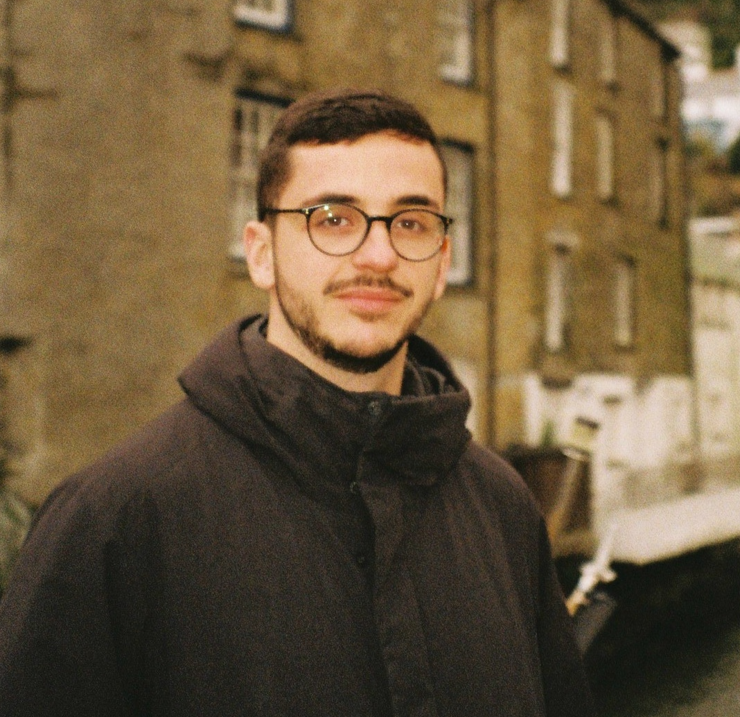

  

Hi! I’m **Alberto Muñoz-Ortiz**, a PhD student in Natural Language Processing at **Universidade da Coruña**, Spain, under the supervision of [David Vilares](http://www.grupolys.org/~david.vilares/) and [Carlos Gómez-Rodríguez](http://www.grupolys.org/~cgomezr/).

I am currently visiting the [NLP Lab](https://nlp.epfl.ch/) at [EPFL](https://www.epfl.ch/schools/ic/) in Lausanne, Switzerland, hosted by [Antoine Bosselut](https://atcbosselut.github.io/) and [Gail Weiss](https://gailweiss.github.io/) until March 2025.

My research focuses on exploring alternative approaches for low-resource scenarios, utilizing techniques such as transfer learning, synthetic data generation, grokking, and the integration of linguistic information like syntactic dependencies. Additionally, I am interested in how large language models differ (or not) from humans in their handling of linguistic structures.

Previously, I was a visiting researcher at the [MaiNLP Research Lab](https://mainlp.github.io/) at [LMU](https://www.lmu.de/en/) in Munich, Germany, hosted by [Barbara Plank](https://bplank.github.io/) during the summer of 2023. Together with Barbara and [Verena Blaschke](https://verenablaschke.github.io/), I explored pixel-based approaches for multilingual language models.
